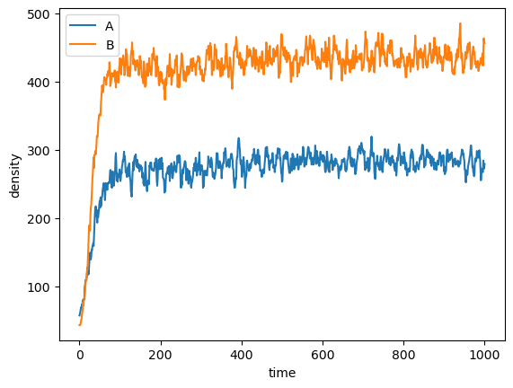
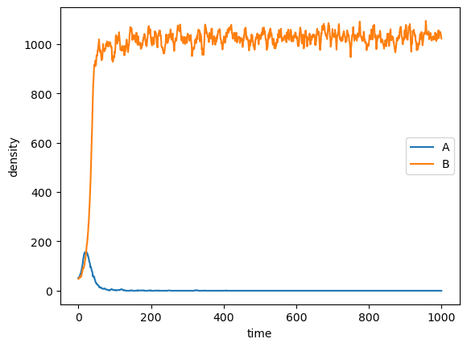
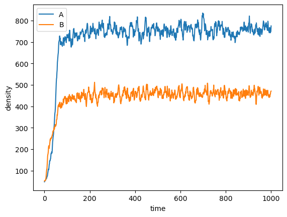
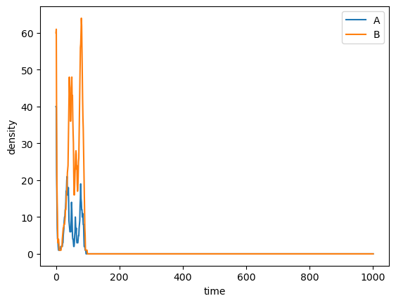
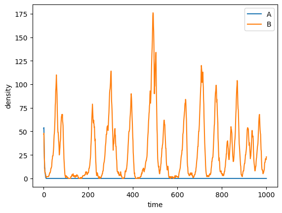
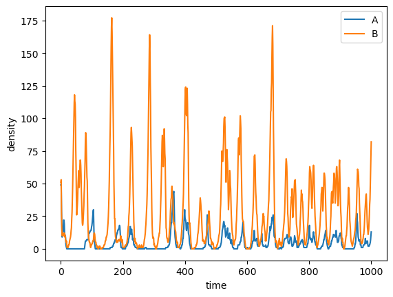

# mutual-dorm

Ford Fishman

## Motivation

What is the interaction between dormancy and the establishment and maintaining of mutualisms in microbes? While crossfeeding might be strongly beneficial to two bacterial species, there are costs associated with producing resources that are only indirectly useful. These costs may inhibit the generation of these mutualisms or perhaps lead to cheating, where some individuals receive the benefits of the mutualism without producing any costly resources themselves. 

Dormancy may help to stabilize these relationships. For instance, while the costs of mutualism may lead to a fitness disadvantage when a shared resource is abundant, it may be beneficial when there are low levels of the shared resource. A seed bank of dormant cells may allow mutualistic cells to persist when selection favors cheaters. Additionally, environmental stochasticity can lead to the fixation of one of the two partners drifting to extinction. A seed bank can drastically reduce the probability of stochastic fixation of mutualistic partners. 

## Models

To address these questions, we have developed two individual-based models (IBMs): one non-spatial, and one spatial. Both implement cells as the primary individuals, or agents, and these cells can be of two types existing in a single population. They both share a common resource and produce secondary metabolites that can be used by the other cell type. 

### Non-spatial IBM

This object-oriented model adapts code from https://acerbialberto.com/IBM-cultevo/, as well as https://github.com/LennonLab/residence-time into a Python-based IBM to study a well-mixed mutualistic system. This model contains several Python scripts, primarily `Cell.py`, `Population.py`, and `main.py`. This repository also contains the bash script `run.sh`.

In the simulations presented here, cells can be type A or B. Both types utilize resource C ($R_C$). Cells have properties, such as size and internal resource density, and exist in a population. A cells produce metabolite A ($R_A$), and B cells produce metabolite B ($R_B$). This production occurs according the mutualistic trait value of each individual cell. Cells also can become dormant (stochastically or based on the concentration of resources available) and resuscitate stochastically. 

#### Cell

`Cell.py` contains the `Cell()` class, which when instantiated is representative of an individual bacterium. Several optional arguments can be passed into the class constructor to specify certain properties, namely cell type (`ty`), mutualistic trait value (`trait`), internal resource concentration (`R`), cost of maintenence (`mt`), cost of cell growth (`g`), and initial cell size (`size`). If any of these are left unspecified, they are randomly initialized such that cell type is either A or B (`Cell.init_ty()`) and all numerical parameters are taken from a uniform distribution on the interval $[0, 1]$ (`Cell.init_traits()`).

The `Cell()` class also contains functions that can change its attributes. `Cell.depleted()` checks if the cell has any remaining resources. `Cell.maintenance()` reduces `Cell.R` to simulate the cost of upkeep. `Cell.growth()` uses `Cell.R` to increase cell size according to growth constant `Cell.g`. `Cell.division()` determines whether the cell will or will not divide based upon `Cell.R` and cell size. The probability of divided is calculated as:

$$p = \frac{R}{1+R}*\frac{size}{1+size}.$$

`Cell.divide()` reduces `Cell.size` and `Cell.R` by 50%. `Cell.produce()` determines the metabolite production of the cell according to the mutualistic trait value. Finally, `Cell.dorm()` calculates the probability of going dormant, which decreases with `Cell.R`. 

#### Population

The `Population()` class is defined in `Population.py`. It takes 5 arguments: `cells` (a list of `Cell()` objects), `resources` (a dictionary of resource names and concentrations), `N` (initial pop. density), `responsive` (whether dormancy is responsive to resource concentration or stochastic), and `dorm` (whether or not population has dormancy). 

`Population()` includes methods for tracking various properties, such as mean cell resource concentration, mutualistic trait values and more. However, the primary method in the `Population()` class is `timestep()`, where the various processes that occur each timestep in set order: (1) resuscitation of dormant cells, (2) internal cell processes, including maintenance, growth, metabolite production, division decisions, and resource uptake, (3) cell death and division, and (4) cell dormancy. Resuscitation occurs via `Population.resc()`, where dormant cells are chose with a constant probability $p_r$ of resuscitation. For internal cell processes, `timestep()` iterates through all cells in the population in a random order that changes each timestep. Cell death occurs deterministically when `Cell.R` reaches 0. 

#### Execution

The primary simulation action occurs in `main.py`. This script reads in parameters from the command line and contains many functions that initialize simulations with these parameters. Execution of the main script can occur in two modes: single simulation or multi-simulation mode, which takes advantage of parallel processing, and creates output in the form of plots and raw data files. Alternatively, `main.ipynb` can be used to run a single simulation and examine the output graphically. `run.sh` can also be used to quickly specify parameters for simulations and create output directories for plots and data.

Importantly, environmental stochasticity can be enabled here by fluctuating the concentration of $R_C$. When enabled, in any given timestep, either 0 or 100 $R_C$ is added into the system. Extreme resource limitation is implemented by increasing the probability of 0 relative to 100 $R_C$. 

### Spatial IBM

The spatial model was construced using the CompuCell3D platform, which has been previously used in biomedical research for explicitely modeling the complex behaviors of human body tissues. This platform allows 2D or 3D modeling of cells made up of several pixels that can grow, divide, interact with each other, and perform many biologically relevant behaviors. 

Like the non-spatial model described above, cells of type A and B are generated with certain properties, including volume, resource concentration, and also coordinate locations in a 2D environment. Cells of type A produce $R_A$, and cells of type B produce $R_B$, as in the non-spatial model. 

#### XML Script

CompuCell3D uses an XML script (`MutualDorm.xml`) to establish the base parameters of the simulation. Various plugins are coded into this file to establish constraints and behaviors, including defining cell types and declaring which cells will initialized and where. The background medium is declared as its own cell type, and it will be initialized as a single cell. The dimensions of the 2D plane of the simulation are defined here, and the boundaries of this plane are defined as "periodic", meaning that the top of the plane is connected to the bottom, as are the left and right boundaries, as opposed to boundaries with solid edges. Resources are also declared, including the speed of their diffusion, and strength of chemotaxis. Here, A cells have chemotaxis towards $R_B$ and $R_C$, while B cells have chemotaxis towards $R_A$ and $R_C$. The medium is set to secrete a constant value of $R_C$ every timestep, and as cells grow and move into pixels previously occupied by the medium, those pixels no longer secrete $R_C$.

Importantly, this script contains information about the contact energies, which essentially define preferences in boundary contact. The low contact energy of cells with the medium relative to cells with other cells means that cells have a slight preference to being in contact compared to other cells. The magnitude of these energies relative to the temperature parameter determine the extent of the preferences. 

#### Python Scripts

Python is used to interface with CompuCell3D and give it customizability and flexibility. In this script, "steppable" classes are initialized, and these classes are used to interact with the simulation at the start, at each timestep, and at the end of each run. This includes plotting, as well as managing the behavior and properties of individual cells. 

The logic of the code is laid out in a similar manner to the non-spatial model, with some key exceptions. Cells possess a target volume, which is increased as they uptake resources. Cells can uptake the resources around them to increase their internal resource reserves. Like the non-spatial model, cells use resources to perform maintenance, produce metabolites, and grow. Presently, this model uses a hard cell division decision, where cells divide once they reach a certain volume. When cells divide, the pixels corresponding to a single cell are split into two separate but adjacent cells. Cell death is implemented by setting cell target volume to zero, which simulates non-instantaneous death. 

Responsive dormancy is implemented in this model in a similar manner to the non-spatial model, where it is based on the internal resource concentration. Here, the target volume of cells is also decreased, to simulate a spore. Similarly, resuscitation occurs as in the non-spatial model except that here there is a corresponding increase in target volume. 

## Results

### Non-Spatial Model

Each simulation was initialized with 100 total cells randomly set to be A or B cells. 100 units of $R_C$ are added each timestep. Simulations were run varying the strength of mutualism, as well as the mode of dormancy (stochastic, responsive, or no dormancy). Simulations were also run with and without environmental stochasticity. All simulations were ran for 1000 timesteps each. 

#### Stable conditions

*Fig.1: Simulation showing coexistance of A and B strains with mutualism enabled (trait = 0.1) and no dormancy.*

*Fig.2: Simulation showing fixation of strain B with mutualism disabled and stochastic dormancy enabled.*

*Fig.3: Simulation showing coeistance of both strains with mutualism enabled (trait = 0.1) and stochastic dormancy enabled.*

With a constant environment, mutualism can allow both strains to coexist with minimal fluctuations in density (Fig.1, Fig.3). Without dormancy, fixation of one of the strains is inevitable (Fig.2). As expected, without a fluctuating environment, dormancy matters very little for long-term coexistence. While full extinction of one of strains may take longer than without dormancy (Fig.2), the frequency of the dominant strain in the seedbank makes it much more likely that it will be resuscitated than the less frequent strain.

#### Fluctuating conditions

Simulations were run with 100 $R_C$ being added to the system with a probability of 6.25% per timestep. This models an environment under extreme resource limitation, where dormancy would provide value. Metabolite production does have a cost for the producer, however. 

*Fig.4: Simulation of energy limitation showing short-term coexistence before extinction of both strains with mutualism (trait = 0.1) enabled and dormancy disabled.*

Without dormancy, neither strain will survive very long. One of the two strains goes to fixation almost immediately. However, without consistent mechanism to maintain this one strain, it goes to extinction rapidly. When mutualism is enabled, because each strain promotes the other's survival, the probability that both strains can coexist temporarily increases, but again, since neither can survive the resource limitation, both go to extinction quickly.

*Fig.5: Simulation of energy limitation showing fixation of one strain with mutualism disabled and stochastic dormancy enabled.*

With the introduction of dormancy, long-term survival becomes possible for a single strain, as the seedbank allows resuscitations to occur when environmental conditions become more favorable. However, one strain still drifts to extinction. Even if the lower frequency strain makes up a part of the seedbank, there is no competitive advantage when rare, so genetic drift will determine its frequency.

*Fig.6: Simulation of energy limitation showing sustained coexistence with mutualism (trait = 0.1) and stochastic dormancy enabled.*

With both dormancy and mutualism acting together, both strains can now coexist in the long-term. Because the dominant strain produces resources that only the less frequent strain can use, this less frequent strain has an advantage when rare. This advantage dissapates as the frequencies of the strains approach each other, as both strains are actively beneficial to each other. 

### Trait evolution

Within a simulation, the mutualistic trait can be allowed to evolve. This is achieved by initializing population with variation in this trait value. Consistently, the average trait value of these populations was approximately $0.5$ and steadily decreased over the course the simulation (Fig.4). As no cells are initialized with a trait value of exactly $0$, the average trait value must remain nonzero. The primary reason for the decrease in the individual-level cost of maintaining mutualism, as producing $R_A$ or $R_B$ uses up resources that could otherwise be converted into cell growth and lead to progeny. 

*Fig.7: Evolution of the average mutualistic trait value of a simulation where A becomes dominant.*

The cost of mutualism is the limiting factor in the total population density. When mutualism is disabled, final total population density can reach much higher levels (Fig.5). A similar result occurs when mutualism is enabled but with no associated cost (Fig.6). 

### Spatial Model

Initially, A and B cells are placed in the middle of the simulation plane within a certain radius surrounded by medium, which actively secretes $R_C$. Once the simulation begins, the functions defined in the steppable classes are executed at each timestep for all cells, causing cells to uptake resources, grow, become dormant, and resuscitate. As cells grow and divide, they cover an increasing portion of the simulation plane until they cover the entire plane (Fig.7). 

Once the cells cover the medium across the whole simulation plane and temporary dynamics subside, the medium can no longer secrete $R_C$. However, as A and B cells have been secreting $R_A$ and $R_B$, respectively, both cell types have available resources. However, resources are only readily available to cells that are in contact with cells of the opposite type, or those which inhabit spaces formerly occupied by those cells.

*Fig.8: CompuCell3D animation of the spatial model showing dynamics over 1000 timesteps of A (blue) and B (green) cells, as well as dormant A (red) and B (yellow) cells, on a 2-dimensional plane. Black edges are present to distinguish between cells.*

Let the densities of A and B cells be $N_A$ and $N_B$. These population densities oscillate over time between $1000$ and $2000$ individuals such that the densities of both cell types are out of phase (Fig.8). When $N_A$ increases, $N_B$ in turn decreases, and the reciprocal also is true. This same pattern is apparent with the dormant populations of A and B ($D_A$ and $D_B$), though the dormant populations are much higher, generally oscillating between $3000$ and $4000$ individuals. 

*Fig.9: Densities of all cell types of the animated simulation above. The colors of the curves match the colors of the cells.*

## Future Directions

### Non-spatial model

While stochastic dormancy is working as intended, the current parameters for responsive dormancy make the individuals too sensitive to resource concentrations. This function currently takes the form of $p_r=\frac{1}{1+R}$, where $p_r$ is the probability of resuscitation. This should be generalized to $p_r=\frac{\alpha}{\beta+R}$, and an array of values for both $\alpha$ and $\beta$ should be tested to optimize performance. A similar generalization could occur 

Evolution of the mutualistic trait value was briefly explored here, but more thorough tests of evolution of the trait with and without dormancy, as well as with and without environmental stochasticity, are necessary. This can be accomplished through job submissions for parameter sweeps. Additional sweeps can be used to explore where different parameters (cost of mutualism, degree of environmental stochasticity, population size, inflow of resources) lead to different outcomes: partner coexistence, maintenance of mutualism, and/or dominance of cheating.

Finally, this model is fairly abstract, and many changes could be made to resemble the lab's set of Bacillus auxotrophs more closely. Such decisions include the following: making dormancy and cell division mutually exclusive so that dormancy cannot occur directly after division; changing the resource model to more closely resemble the Kost auxotroph setup; more specific and realistic source of environmental disturbances besides explicit resources, such as desication; and randomization of the order of the internal cell processes. Additionally, the model could made more flexible to allow for only one partner to have dormancy. 

### Spatial model

While the base CompuCell3D model is in place, the spatial model requires much tweaking and modification to produce desired behavior, including changing the initial location of cell initialization, the decision function for cell division, the size of dormant cells relative to active cells, the cost of producing metabolites, the strength of chemotaxis, and the rate of production of $R_C$ by the medium. Of these modifications, perhaps the most important is that this model does not yet include a cost for metabolite secretion, which would likely change the behavior of the model based on the magnitude of the cost. The groundwork laid out in this repository for this model will assist these endeavors, in addition to providing a template for using CompuCell3D to study microbial interactions. 

