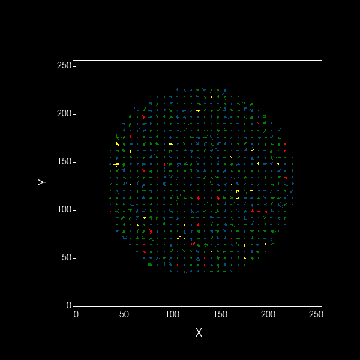
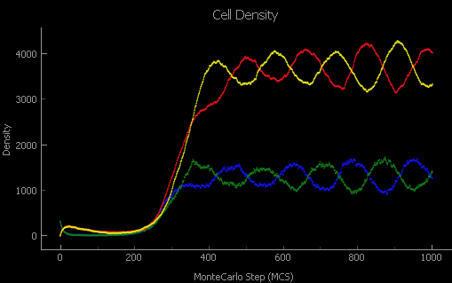

# mutual-dorm

Ford Fishman

## Motivation

What is the interaction between the establishment and maintaining of mutualisms and dormancy in microbes? While crossfeeding might be strongly beneficial to two bacterial species, there are  costs associated with producing resources that are only indirectly useful. These costs may inhibit the generation of these mutualisms or perhaps lead to cheating, where some individuals receive the benefits of the mutualism without producing any costly resources themselves. 

Dormancy may help to stabilize these relationships. For instance, while the costs of mutualism may lead to a fitness disadvantage when a shared resource is abundant, it may be beneficial when there are low levels of the shared resource. A seed bank of dormant cells may allow mutualistic cells  Additionally, environmental stochasticity can lead to the fixation of one of the two partners drifting to extinction. A seed bank can drastically reduce the probability of stochastic extinction. 

## Models

To address these questions, we have developed two individual-based models (IBMs), one non-spatial, and one spatial. Both contain cells are the primary individuals, or agents, and these cells can be of two types existing in a single population. They both share a common resource and produce secondary metabolites that can be used by the other cell type. 

### Non-spatial IBM

This object-oriented model adapts code from https://acerbialberto.com/IBM-cultevo/, as well as https://github.com/LennonLab/residence-time into a Python-based IBM to study a well-mixed mutualistic system. This model contains several Python scripts, primarily `Cell.py`, `Population.py`, and `main.py`. This repo also contains the bash script `run.sh`.

In the simulations presented here, cells can be type A or B. Both types utilize resource C ($R_C$). Cells have properties, such as size and internal resource density, and exist in a population. A cells produce metabolite A ($R_A$), and B cells produce metabolite B ($R_B$). This production occurs according the mutualistic trait value of each individual cell. Cells also can become dormant (stochastically or based on the concentration of resources available) and resuscitate stochastically. 

#### Cell

`Cell.py` contains the `Cell()` class, which when instantiated is representative of an individual bacterium. Several optional arguments can be passed into the class constructor to specify certain properties, namely cell type (`ty`), mutualistic trait value (`trait`), internal resource concentration (`R`), cost of maintenence (`mt`), cost of cell growth (`g`), and initial cell size (`size`). If any of these are left unspecified, they are randomly initialized such that cell type is either A or B (`Cell.init_ty()`) and all numerical parameters are taken from a uniform distribution on the interval $[0, 1]$ (`Cell.init_traits()`).

The `Cell()` class also contains functions that can change certain of its attributes. `Cell.depleted()` checks if the cell has any remaining resources. `Cell.maintenance()` reduces `Cell.R` to simulate the cost of upkeep. `Cell.growth()` uses `Cell.R` to increase cell size according to growth constant `Cell.g`. `Cell.division()` determines whether the cell will or will not divide based upon `Cell.R` and cell size. The probability of divided is calculated as:

$$p = \frac{R}{1+R}*\frac{size}{1+size}.$$

`Cell.divide()` reduces `Cell.size` and `Cell.R` by 50%. `Cell.produce()` determines the metabolite production of the cell according to the mutualistic trait value. Finally, `Cell.dorm()` calculates the probability of going dormant, which decreases with `Cell.R`. 

#### Population

The `Population()` class is defined in `Population.py`. It takes 5 arguments: `cells` (a list of `Cell()` objects), `resources` (a dictionary of resource names and concentrations), `N` (initial pop. density), `responsive` (whether dormancy is responsive to resource concentration or stochastic), and `dorm` (whether or not population has dormancy). 

`Population()` includes methods for tracking various properties, such as mean cell resource concentration, mutualistic trait values and more. However, the primary method in the `Population()` class is `timestep()`, where the various processes that occur each timestep in set order: (1) resuscitation of dormant cells, (2) internal cell processes, including maintenance, growth, metabolite production, division decisions, and resource uptake, (3) cell death and division, and (4) cell dormancy. Resuscitation occurs via `Population.resc()`, where dormant cells are chose with a constant probability $p_r$ of resuscitation. For internal cell processes, `timestep()` iterates through all cells in the population in a random order. Cell death occurs when `Cell.R` reaches 0. 

#### Execution

The primary simulation action occurs in `main.py`. This script reads in parameters from the command line and contains many functions that initialize simulations with these parameters. Execution of the main script can occur in two modes: single simulation or multi-simulation mode, which takes advantage of parallel processing, and creates output in the form of plots and raw data files. Alternatively, `main.ipynb` can be used to run a single simulation and examine the output graphically. 

`run.sh` can also be used to quickly specify parameters for simulations and create output directories for plots and data.

### Spatial IBM

The spatial model was construced using the CompuCell3D platform, which has been previously used in biomedical research for explicitely modeling the complex behaviors of human body tissues. This platform allows 2D or 3D modeling of cells made up of several pixels that can grow, divide, interact with each other, and perform many biologically relevant behaviors. 

Like the non-spatial model described above, cells of type A and B are generated with certain properties, including volume, resource concentration, and also coordinate locations in a 2D environment. Cells of type A produce $R_A$, and cells of type B 

#### XML Script

CompuCell3D uses an XML script (`MutualDorm.xml`) to establish the base parameters of the simulation. Various plugins are coded into this file to establish constraints and behaviors, including defining cell types and declaring which cells will initialized and where. The background medium is declared as its own cell type, and it will be initialized as a single cell. The dimensions of the 2D plane of the simulation are defined here, and the boundaries of this plane are defined as "periodic", meaning that the top of the plane is connected to the bottom, as are the left and right, as opposed to boundaries with solid edges. Resources are also declared, including the speed of their diffusion, and strength of chemotaxis. Here, A cells have chemotaxis towards $R_B$ and $R_C$, while B cells have chemotaxis towards $R_A$ and $R_C$. The medium is set to secrete a constant value of $R_C$ every timestep, and as cells grow and move into pixels previously occupied by the medium, those pixels no longer secrete $R_C$.

Importantly, this script contains information about the contact energies, which essentially define preferences in boundary contact. The low contact energy of cells with the medium relative to cells with other cells means that cells have a slight preference to being in contact compared to other cells. The magnitude of these energies relative to the temperature parameter determine the extent of the preferences. 

#### Python Scripts

Python is used to interface with CompuCell3D and give it customizability and flexibility. In this script, "steppable" classes are initialized, and these classes are used to interact with the simulation at start, at each timestep, and at the end of each run. This includes plotting, as well as managing the behavior and properties of individual cells. 

The logic of the code is laid out in a similar manner to the non-spatial model, with some key exceptions. Cells possess a target volume, which is increased as they uptake resources. Cells can uptake the resources around them to increase their internal resource reserves. Like the non-spatial model, cells use resources to perform maintenance, produce metabolites, and grow. Presently, this model uses a hard cell division decision, where cells divide once they reach a certain volume. When cells divide, the pixels corresponding to a single cell are split into two separate but adjacent cells. Cell death is implemented by setting cell target volume to zero, which simulates non-instantaneous death. 

Responsive dormancy is implemented in this model in a similar manner to the non-spatial model, where it is based on the internal resource concentration. Here, the target volume of cells is also decreased, to simulate a spore. Similarly, resuscitation occurs as in the non-spatial model except that here there is a corresponding increase in target volume. 

## Results

### Non-Spatial Model

Ran model with dormancy on, off, stochastic, responsive, with mutualism on and off

### Spatial Model

Initially, A and B cells are placed in the middle of the simulation plane within a certain radius surrounded by medium, which actively secretes $R_C$. Once the simulation begins, the functions defined in the steppable classes are executed at each timestep for all cells, causing cells to uptake resources, grow, become dormant, and resuscitate. As cells grow and divide, they cover an increasing portion of the simulation plane until they cover the entire plane (Fig. 3). 

Once the cells cover the medium across the whole simulation plane and temporary dynamics subside, the medium can no longer secrete $R_C$. However, as A and B cells have been secreting $R_A$ and $R_B$, respectively, both cell types have available resources. However, resources are only readily available to cells that are in contact with cells of the opposite type, or those which inhabit spaces formerly occupied by those cells.

<!--  -->

*CompuCell3D animation of the spatial model showing dynamics over 1000 timesteps of A (blue) and B (green) cells, as well as dormant A (red) and B (yellow) cells, on a 2-dimensional plane. Black edges are present to distinguish between cells.*

Let the densities of A and B cells be $N_A$ and $N_B$. These population densities oscillate over time between $1000$ and $2000$ individuals such that the densities of both cell types are out of phase. When $N_A$ increases, $N_B$ in turn decreases, and the reciprocal also is true. This same pattern is apparent with the dormant populations of A and B ($D_A$ and $D_B$), though the dormant populations are much higher, generally oscillating between $3000$ and $4000$ individuals. 

<!--  -->

*Densities of all cell types of the animated simulation above. The colors of the curves match the colors of the cells.*

## Future Directions

### Non-spatial model

In its present form, this non-spatial model contains several unanticipated behaviors. Work out bugs with non-spatial IBM

### Spatial model

There are several steps to be taken that will ensure the spatial model is behaving properly.  

